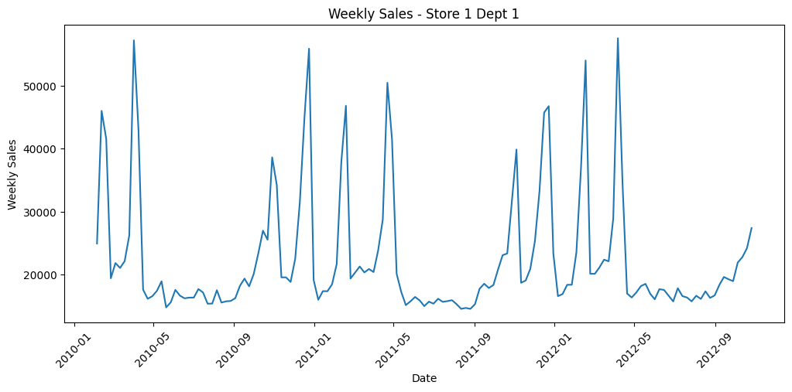
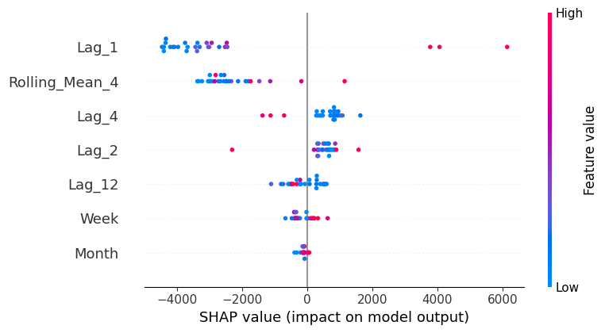
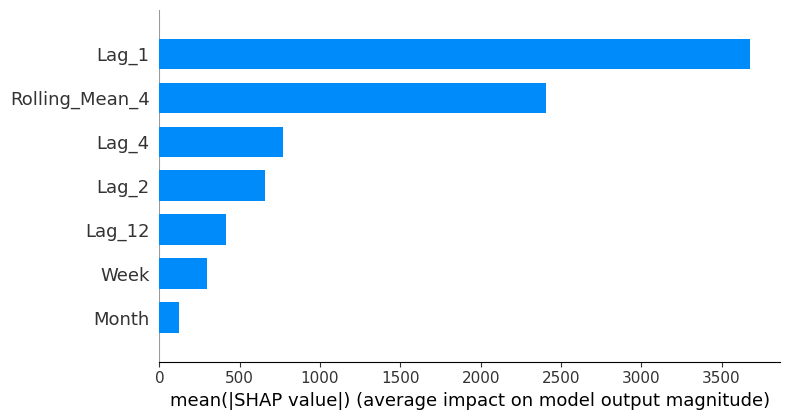
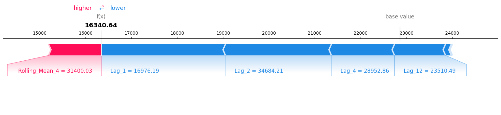

<div style="font-size: 13px;">

<h1>📌 Interpretable Retail Demand Forecasting using Machine Learning & Statistical Models</h1>

A complete end-to-end retail demand forecasting system built using **Time-Series Machine Learning, ARIMA/SARIMA models, XGBoost, and SHAP-based interpretability**.

---

 <h2> 🚀 Project Overview </h2>

This project forecasts **weekly retail demand** using the **Walmart Sales Forecasting Dataset**.
The objective is to **compare baseline, statistical, and machine learning models** and identify the most accurate and interpretable forecasting approach for real-world retail planning.

<h3> 🔄 Workflow Summary </h3>

* 📊 Exploratory Time-Series Analysis
* 🧮 Feature Engineering (lags, rolling windows, seasonality extraction)
* 🧠 Model Building

  * Naive Baseline
  * Linear Regression
  * Random Forest
  * XGBoost
  * ARIMA / SARIMA
* 📉 Evaluation: RMSE, MAE, MAPE
* 🔍 SHAP Interpretability
* 🧾 Business Insights & Recommendations

---

<h2> 🗂️ Dataset </h2>

**Source:** Walmart Weekly Sales Forecasting Dataset (Kaggle)

<h3> Features Used </h3>

* `Store`
* `Dept`
* `Date`
* `Weekly_Sales`
* `IsHoliday`

After filtering:

* **Store:** 1
* **Department:** 1
* **143 weekly observations**

---

<h2> 📊 1. Exploratory Data Analysis (EDA) </h2>

<h3> Weekly Sales Time Series (Actual Visualization) </h3>



<h3> Key Observations </h3>

* Seasonal spikes around holidays
* No strong long-term trend
* Stable sales between holiday peaks
* High short-term autocorrelation

Sales patterns indicate:

* Momentum-driven behavior
* Seasonally reactive variations
* Irregular spike-heavy structure

---

<h2> 🛠️ 2. Feature Engineering </h2>

To convert the time series into a supervised ML problem:

<h3> 📌 Lag Features </h3>

* `Lag_1` (last week)
* `Lag_2`
* `Lag_4` (1 month prior)
* `Lag_12` (seasonal memory)

<h3> 📌 Rolling Window Features </h3>

* `Rolling_Mean_4` — smooths short-term fluctuations

<h3> 📌 Date Features </h3>

* `Month`
* `Week`

These features enable machine learning models to capture temporal dependencies effectively.

---

<h2> 🧪 3. Train–Test Strategy </h2>

* **Train–Test Split:** 80% train, 20% test
* **No shuffling** → avoids time leakage
* **TimeSeriesSplit CV** used for Random Forest & XGBoost

---

<h2> 🤖 4. Models Implemented </h2>

<h3> 🔹 Naive Baseline </h3>

Predicts
**Next week = Last week (Lag_1)**
Works well because of strong autocorrelation.

<h3> 🔹 Linear Regression </h3>

Simple model; struggles on nonlinear spikes.

<h3> 🔹 Random Forest </h3>

Captures nonlinearity better than linear models.

<h3> 🔹 XGBoost (🔥 Best Model) </h3>

Gradient boosting with tuned hyperparameters.
Best performance on **all** metrics:

* Lowest RMSE
* Lowest MAE
* Lowest MAPE

<h3> 🔹 ARIMA & SARIMA </h3>

SARIMA failed due to inconsistent seasonality.
ARIMA improved but still far below ML models.

---

<h2> 📈 5. Model Performance Comparison </h2>

| Model              | RMSE     | MAE     | MAPE      |
| ------------------ | -------- | ------- | --------- |
| Naive              | 1308     | 1077    | 5.73%     |
| Linear Regression  | 3037     | 1455    | 8.45%     |
| Random Forest      | 1336     | 966     | 4.92%     |
| **XGBoost (Best)** | **1114** | **782** | **4.01%** |
| SARIMA             | 14016    | 13310   | 75.32%    |
| ARIMA              | 10455    | 9664    | 55.59%    |

Winner: **XGBoost**

> ~65% improvement over linear regression and significantly beats statistical models.

---

<h2> 🔍 6. SHAP Interpretability (Explainable ML) </h2>

SHAP was applied to explain XGBoost predictions.

<h3> Key Insights </h3>

* **Lag_1** dominates (~57% importance)
* **Lag_2** also important
* `Rolling_Mean_4` raises predictions when recent momentum is high
* `Lag_12` contributes less (weak long-term seasonality)
* Holiday effects inconsistent

Conclusion:
Retail demand is **short-memory driven**, not long-term seasonal.

<h3> SHAP Plot </h3>

<h3>SHAP Summary Plot</h3>


<h3>SHAP Bar Plot</h3>


<h3>SHAP Local Decision Plot</h3>


---

<h2> 🧾 7. Business Insights </h2>

✔ Recent demand (Lag_1, Lag_2) is the strongest predictor
✔ Spikes caused by promotions/holidays are inconsistent
✔ ARIMA/SARIMA struggle with irregular retail behavior
✔ XGBoost handles spikes + nonlinearity exceptionally well

These findings help with:

* Better inventory planning
* Understanding demand momentum
* Avoiding over-reliance on classical forecasting models

---

<h2> 🧱 8. Tech Stack </h2>

* Python
* Pandas
* NumPy
* Matplotlib
* Scikit-learn
* Statsmodels
* XGBoost
* SHAP

---

<h2> 📂 Project Structure </h2>

```
Retail_Demand_Forecasting/
│
├── data/
│   ├── features.xlsx
│   ├── stores.xlsx
│   ├── test.xlsx
│   ├── train.xlsx
│
├── notebook/
│   ├── .venv/
│   ├── images/
│   │     ├── weekly_sales_store1_dept1.png
│   │     ├── shap-summary1.png
│   │     ├── shap-summary2.png
│   │     ├── shap-summary3.png
│   │
│   ├── 01_EDA.ipynb            
│   ├── README.md               
│
└── (no root README.md)
```

---

<h2> 🧠 9. Key Learnings </h2>

* Time-series forecasting requires **data-aware splitting**
* Lag features outperform complex statistical models
* **Boosting > Bagging > Linear models** for nonlinear patterns
* SHAP is essential for **interpretable ML**
* Retail data is messy → classical ARIMA often fails

---

<h2> 🏁 10. Final Summary </h2>

This project demonstrates a fully interpretable retail forecasting workflow covering:

✔ EDA
✔ Feature Engineering
✔ Model Comparison
✔ Time-Series CV
✔ SHAP Explainability
✔ Business Insights

**XGBoost is the most accurate & reliable forecasting model for retail demand.**

---

<h2> ⭐ Support </h2>

If this repository helped you, please consider **starring the project**!

---

</div>
